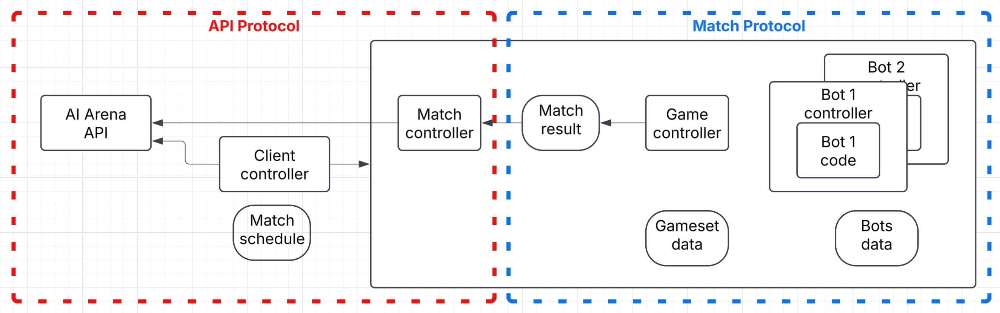

# AI Arena client

This client runs bot matches for [AI Arena](https://aiarena.net/).
It started with StarCraft II (SC2) and evolved to support any other 1v1 game.

## Environment

The client can run in either Kubernetes or Docker environment.

### Kubernetes environment

The client is deployed in Kubernetes using the deployment descriptors in branch [`kubernetes`](https://github.com/aiarena/sc2-ai-match-controller/tree/kubernetes).
The descriptors are produced by their source under [/kubernetes](./kubernetes/).
The deployment is performed with GitHub Action [Release](/actions/workflows/release.yml).

Configure it via the environment variables in the deployment descriptor or `config.toml` file as a Kubernetes ConfigMap.

### Docker environment

The client is started with this executable (TBD: Release Rust executable and link it).
It uses Docker Compose to spin up the Docker containers of the game and bots.

Configure it via environment variables or `config.toml` file in the directory of the executable.

## Configuration

| Parameter | Kubernetes | Docker | Default | Description |
|-----------|------------|--------|---------|-------------|
| VERSION | ✔ | ✔ | latest | The desired version of AI Arena client |
| BOT_CONTROLLER | ✔ | ✔  | aiarena/arenaclient-bot:&lt;VERSION&gt; | The default bot controller Docker image to run matches |
| GAME_CONTROLLER | ✔ | ✔  | aiarena/arenaclient-sc2:&lt;VERSION&gt; | The default game controller Docekr image to run matches |
| API_URL | ✔ | ✔ | https://aiarena.net/api/ | The URL of the AI Arena API server |
| API_CLIENT | ✔ | ✔ | - |
| API_TOKEN | ✔ | ✔ | - |
| MATCHES_LIST | ✘ | ✔ | - | A file containing the list of matches to run |
| BOTS_DIRECTORY | ✘ | ✔ | ./bots | The directory containing the code and data of bots |
| GAMESETS_DIRECTORY | ✘ | ✔  | ./gamesets | The directory containing the gamesets (e.g. SC2 maps) |
| LOGS_DIRECTORY | ✘ | ✔  | ./logs | The directory where the client will write its logs |

## Matches

The client runs bot matches by connecting two **Bot controller**s to one **Game controller**.
Matches are scheduled using a local file or **AI Arena API**.
When scheduled using a local file, the client checks the matches against their expected outcome.



### Match schedule using local file

When parameter **MATCHES_LIST** points to a file with list of matches, the client will use it as the schedule.

The file should list a match per line in the following format:
```
<player-1-bot-id>,<player-1-bot-name>,<player-1-bot-race>,<player-1-bot-type>[@<player-1-bot-base>],<player-2-bot-id>,<player-2-bot-name>,<player-2-bot-race>,<player-2-bot-type>[@<player-2-bot-base>],<gameset-id>[,<expected-match-outcome>]
...
```

Empty lines and lines starting with `#` are ignored.

Here is an example of matches list file:
```
1,basic_bot,T,python,2,js_bot,T,nodejs,AutomatonLE,Player1Win

# This is a comment line
1,basic_bot,T,python,2,js_bot,T,nodejs@node:23-alpine,AutomatonLE,Player1Win
```

> [!NOTE]  
> The client will exit with code `2` when the expected match outcome doesn't match the actual match outcome.

### Match schedule using AI Arena API

When no match schedule file is given, and **API_URL**, **API_CLIENT**, **API_TOKEN** are valid, the client will call AI Arena API for the schedule of matches.

> [!NOTE]  
> When using https://aiarena.net/api/ as **API_URL**, the client must be registered with AI Arena.

When the client has capacity to run a match it will issue a POST request identifying itself as a client.

```
POST /api/arenaclient/v4/request-match/
Authorization: Token ...
```

When the website has a match for this client, it will assign the match to this client and respond with the information on game, gameset, and player bots:
```json
{
  match: 101,       // Match identifier on AI Arena
  competition: 201, // Competition identifier on AI Arena. Used for analytics.
  game: {
    base: "aiarena/game-sc2:2026.01.22-11.13", // Docker image of game controller
  },
  gameset: {                       // Optional. File or bundle of files for this match
    id: "UltraloveAIE_v2.SC2Map",  // Identifier of gameset
    url: "https://...",            // URL to download gameset
    md5hash: "MXZ...",             // Base64-encoded MD5 hash for caching and integrity checks
  },
  players: [
    {
      bot_id: 301,                                // Bot identifier on AI Arena
      name: "SampleBot",                          // Human-readable name of the player
      display_id: "abc-def",                      // In-game identifier of the player
      base: "aiarena/game-bot2:2026.01.22-11.13", // Optional. Docker image of bot controller
      type: "python",
      race: "Random",
      code: {                // Optional. Bot code zip file
        url: "https://...",  // URL to download bot code zip file
        md5hash: "MXZ...",   // Base64-encoded MD5 hash for caching and integrity checks
      },
      data: {                // Optional. Bot data zip file
        url: "https://...",  // URL to download bot data zip file
        md5hash: "MXZ...",   // Base64-encoded MD5 hash for caching and integrity checks
      }
    },
    {
      name: "Challenger",
      bot_id: 302,
      display_id: "uvw-xyz",
      base: "node:23-alpine",
      type: "nodejs",
      race: "Protoss",
    }
  ]
}
```

When the website fails to assign a match to this client, it will respond with error message:
```json
{
  error: "No match available at the moment"
}
```

Upon receiving match details for a scheduled match, the client will start the match, game, and bot controllers to run the match using the [Match protocol](#match-protocol).

The match controller will use [Arena protocol](#arena-protocol) to download match assets and later upload match results.

### Match protocol

The protocol allows the client to run matches between any bots on any game through a simple interface.

> [!NOTE]  
> Game and bot controllers must be available as Docker images.
> They don't interact with AI Arena API.

#### Game controller

The game controller is started with the following parameters:

| Parameter | Default | Description |
|-----------|---------|-------------|
| MATCH_ID | - | Identifier of this match |
| GAMESET_ID | - | Optional identifier of the gameset for this match |
| PLAYER_1_SEAT | 10001 | The TCP port for player 1 |
| PLAYER_1_ID | - | Identifier of player 1 |
| PLAYER_1_NAME | - | Name of player 1 |
| PLAYER_1_RACE | - | Race of player 1 |
| PLAYER_2_SEAT | 10002 | The TCP port for player 2 |
| PLAYER_2_ID | - | Identifier of player 2 |
| PLAYER_2_NAME | - | Name of player 2 |
| PLAYER_2_RACE | - | Race of player 2 |

It must listen on the 2 given TCP ports for connections by the player bots.

It should read the identified gameset from a folder mounted as `/gameset/`.
The gameset is a file or a directory with files for playing the game.

It should detect the end of the game and produce file `/match/match-result.json` with the following format:
```json
{
  "match": 101,               // Match identifier
  "result": "Player1Win",     // One of "Player1Win", "Player2Win", "Tie", "None"
  "status": "OK",             // One of "OK", "Error", "Timeout"
  "players": [
    {
      "bot_id": 301,          // Bot id of player 1
      "tags: [
        ...
      ],
      "status": "OK",         // One of "OK", "Error", "Timeout",
      "avg_step_time": 12.56, // Average step time of player 1
    },
    ...
  ],
  "game_steps": 2901,         // Game steps of the match
}
```

It should use folder `/logs/` for its logs.

[sc2_controller](./sc2_controller/) is a reference implementation of a game controller.

#### Bot controller

The bot controller is started with the following parameters:

| Parameter | Default | Description |
|-----------|---------|-------------|
| GAME_HOST | 127.0.0.1 | The hostname or IP address of the game controller |
| GAME_PORT | - | The port corresponding to `PLAYER_1_SEAT` or `PLAYER_2_SEAT` of the game controller |
| GAME_PASS | - | A pass code for connecting to the game |
| BOT_ID | - | The id of the player bot |
| BOT_NAME | - | The name of the player bot |
| OPPONENT_ID | - | The id of the opponent player |
| OPPONENT_NAME | - | The name of the opponent player |

If the bot has code and data, the controller will receive them under `/bot/` and `/bot/data` respectively.

The bot controller should start the given bot and connect it to the game at the given address.
Pass code handling is game-specific and may be required to connect to the game.
Opponent information should be provided to the bot for its use.

The bot controller should use folder `/logs/` for its logs. The contents of this folder will be made publicly accessible on AI Arena.
It should use folder `/bot/logs/` for the logs of the bot. The contents of this folder will be made privately accessible to the bot author on AI Arena.

[bot_controller](./bot_controller/) is a reference implementation of a bot controller.

### Arena protocol

When **API_URL**, **API_CLIENT**, **API_TOKEN** are valid, the match controller will use AI Arena API to read the details of the match, download all match assets, and later submit the result.

#### Match controller reads the match details

Match controllers may read the match details by match identifier with a call to AI Arena.
The reason for a second call for the same match details is that in a Kubernetes environment the client and match controllers are isolated and cannot easily share the match details.
The client should be able to leave it to the match controller to fetch the details from AI Arena when it's not optimal to pass this information via other means.

```
GET /api/arenaclient/v4/match/<match_id>
Authorization: Token ...
```

The result is in the same format as [the response when requesting a match](#match-schedule-using-ai-arena-api).
However, when reading the match details by match identifier, the website doesn't change the client assignment of the given match.
If the match was assigned to a client, it remains assigned to the same client.
If the match was not assigned to any client, it remains assigned to no client.

#### Match controller downloads match assets

Upon receiving match details, the match controller will download the included gamesets and bots' code and data using the URL-s received in the match details:

```
GET /api/arenaclient/v4/bot/<bot_id>/code/

GET /api/arenaclient/v4/bot/<bot_id>/data/

GET /api/arenaclient/v4/gameset/<gameset_id>/
```

Failure to download any asset results in submission of initialization error result.

#### Match controller submits results

Once the match is complete, the match controller sends a multi-part POST request to AI Arena containing the match result, replay file, client logs including all controller logs, bot logs, and updated bots data.

```
POST /api/arenaclient/v4/submit-result/
Content-Type: multipart/form-data
Authorization: Token ...

{
  "match": 101,               // Match identifier
  "result": "Player1Win",     // One of "Player1Win", "Player2Win", "Tie", "None"
  "status": "OK",             // One of "OK", "Error", "Timeout"
  "players": [
    {
      "bot_id": 301,          // Bot id of player 1
      "tags: [
        ...
      ],
      "status": "OK",         // One of "OK", "Error", "Timeout",
      "avg_step_time": 12.56, // Average step time of player 1
    },
    ...
  ],
  "game_steps": 2901,         // Game steps of the match
}
-----------------------------
Content-Disposition: form-data; name="replay_file"
-----------------------------
Content-Disposition: form-data; name="client_logs"
-----------------------------
Content-Disposition: form-data; name="bot1_data"
-----------------------------
Content-Disposition: form-data; name="bot1_logs"
-----------------------------
Content-Disposition: form-data; name="bot2_data"
-----------------------------
Content-Disposition: form-data; name="bot2_logs"
-----------------------------
```

## Contributing
Pull requests are welcome. For major changes, please open an issue first to discuss what you would like to change.

Please make sure to update tests in [testing](./testing/README.md) as appropriate.

## License
[GNU GPLv3](https://choosealicense.com/licenses/gpl-3.0/)
